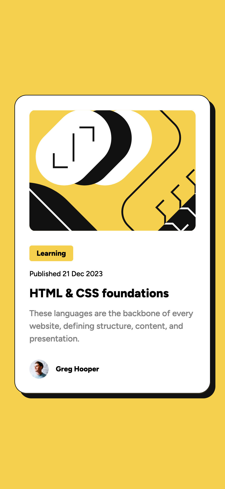
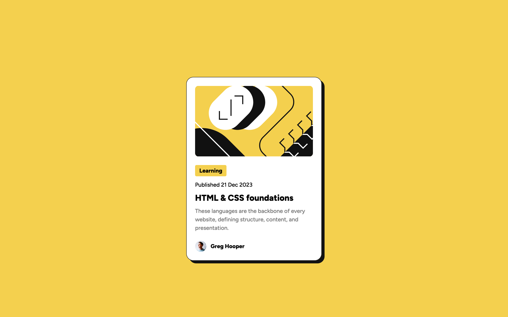

# Frontend Mentor - Blog preview card solution

This is a solution to the [Blog preview card challenge on Frontend Mentor](https://www.frontendmentor.io/challenges/blog-preview-card-ckPaj01IcS). Frontend Mentor challenges help you improve your coding skills by building realistic projects.

## Table of contents

- [Overview](#overview)
  - [The challenge](#the-challenge)
  - [Screenshot](#screenshot)
  - [Links](#links)
- [My process](#my-process)
  - [Built with](#built-with)
  - [What I learned](#what-i-learned)
  - [Continued development](#continued-development)
  - [Useful resources](#useful-resources)
- [Author](#author)
- [Acknowledgments](#acknowledgments)

## Overview

### The challenge

Users should be able to:

- See hover and focus states for all interactive elements on the page

### Screenshot




### Links

- Solution URL: [blog-preview-card-component-solution](https://www.frontendmentor.io/solutions/blog-preview-card-iMa8vl8bHg)
- Live Site URL: [blog-preview-card-component](https://blog-preview-card-component-omega.vercel.app/)

## My process

### Built with

- Semantic HTML5 markup
- CSS custom properties
- Flexbox
- Mobile-first workflow

### What I learned

```html
<div class="author">
	
	<p class="author__name">Greg Hooper</p>
</div>
```

### Continued development

- CSS Sass functions
- CSS media queries

### Useful resources

- [Auto resize an image](https://sentry.io/answers/how-do-i-auto-resize-an-image-to-fit-a-div-container/) - This article explain how to use the object fit property on an  element to fit the div container.

## Author

- Frontend Mentor - [@mayor-creator](https://www.frontendmentor.io/profile/mayor-creator)
- Thread - [@mayor_creator](https://www.threads.net/@mayor_creator)

## Acknowledgments

- Coder Coder Youtube [How to write media queries in css](https://www.youtube.com/watch?v=IsC5-C_nuF4)
